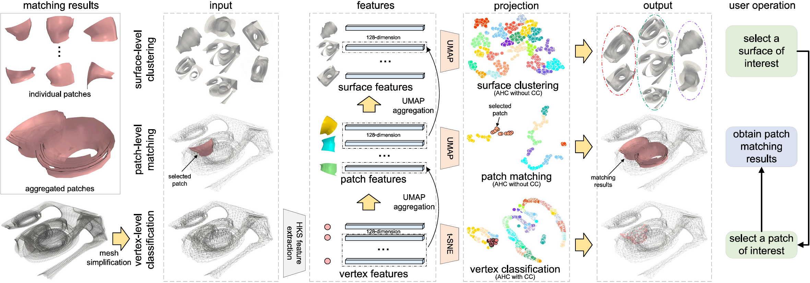

# SurfPatch: Enabling Patch Matching for Exploratory Stream Surface Visualization

[Delin An](https://github.com/adlsn)<sup>1</sup> and [Chaoli Wang](https://sites.nd.edu/chaoli-wang/)<sup>1</sup>

University of Notre Dame<sup>1</sup>

<div align='center'>

</div>

## Introduction
> SurfPatch is a framework for exploratory stream surface visualization, addressing the challenges of placement, speed, perception, and evaluation in surface-based flow visualization. The method translates surface placement into a selection problem, leveraging a hierarchical, bottom-up approach with vertex-level classification, patch-level matching, and surface-level clustering for fine-grained multiscale analysis. SurfPatch supports both steady and unsteady flows and isosurfaces from scalar fields, providing an intuitive interface for users to explore and analyze stream surfaces.
---
## Architecture overview of SurfPatch
> SurfPatch is for analyzing stream surfaces generated from vector field data through a three-stage process: (1) classifying vertices based on Heat Kernel Signature (HKS) features and partitioning the surface into fine-grained patches using Agglomerative Hierarchical Clustering (AHC) with connectivity constraints, (2) matching similar patches within or across surfaces by aggregating vertex-level features into patch-level features, and (3) clustering surfaces by further aggregating patch-level features into surface-level features, enabling efficient querying and exploration of patches and surfaces.
<div align='center'>

</div>

## Installation
The code is developed by Python. After cloning the repository, follow the below steps for installation,
1. Create and activate the conda environment
```python
conda create --name surfpatch python=3.10
conda activate surfpatch
```
2. Install dependencies
```python
pip install -r requirements.txt
```

## Dataset
SurfPatch could handle stream surfaces generated by steady and unsteady flow and isosurfaces extracted from scalar fields. 
The dataset folders for surfaces should be organized as follows:
```
./dataset/
|
├── data/
├── gallery/
├── hks_feature/
├── patch/
│   └── level1/
├── project2d/
│   └── level1/
```


